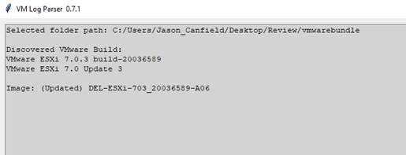
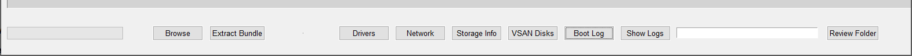

# VMware Log Parser

To get started you can choose to browse using the **“Browse”** button to open a folder that already contains extracted VMware bundle or use the **“Extract Bundle”** button to select either a .zip or .tgz VMware bundle file to extract and review.

Once a bundle has been opened/extracted you will see the version info listed for that build of ESXI and you can begin using the other information buttons to look at what info you may need.

## Information Buttons:

- **Drivers:** This will pull information from multiple files to find out what drivers are enabled and then match those enabled drivers against all the installed drivers and then list out those drivers and version info.  It will also find any Dell VIBs installed and list those as well.

- **Network:** This will show the NIC states from nicinfo as well as show the contents from vswitch and vmknic files to display the switch config and VMK’s configured.

- **Storage Info:** This will display storage info pulling from adapter, nvme, filesystem, path and core storage lists.  Here you can see what adapters are installed, any NVMe drives, mounted datastores, Physical disk info and SAS Address info for tracking VSAN disk slots.

- **VSAN Disks:** Here you will see the drives and any VSAN disk group info from the vsan disk file.  If the file contains errors, it’ll flag the disk with errors in red.  It will also mark red any disks that show in PDL or size of 0B indicating needs attention.

- **Boot Log:** This simply shows the shutdown, reboot, boot info for tracking unexpected shutdowns/reboots or crashes.

- **Show Logs:** This will unzip all the vmkernel.gz files and display the contents of all vmkernel log files combined. The search box next to it will allow you to filter for only certain keywords from the logs.

- **Review Folder:** This will show the folder where the saved output of each of the info would be stored if needed.

